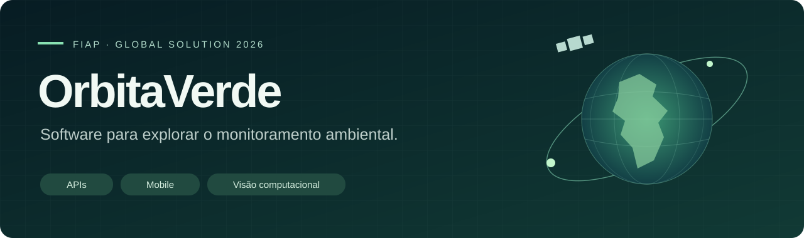
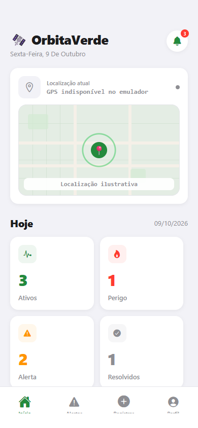
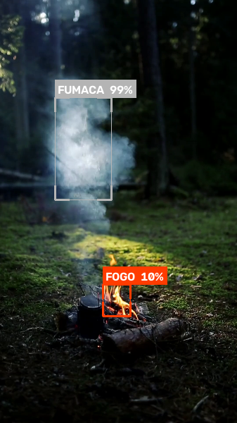
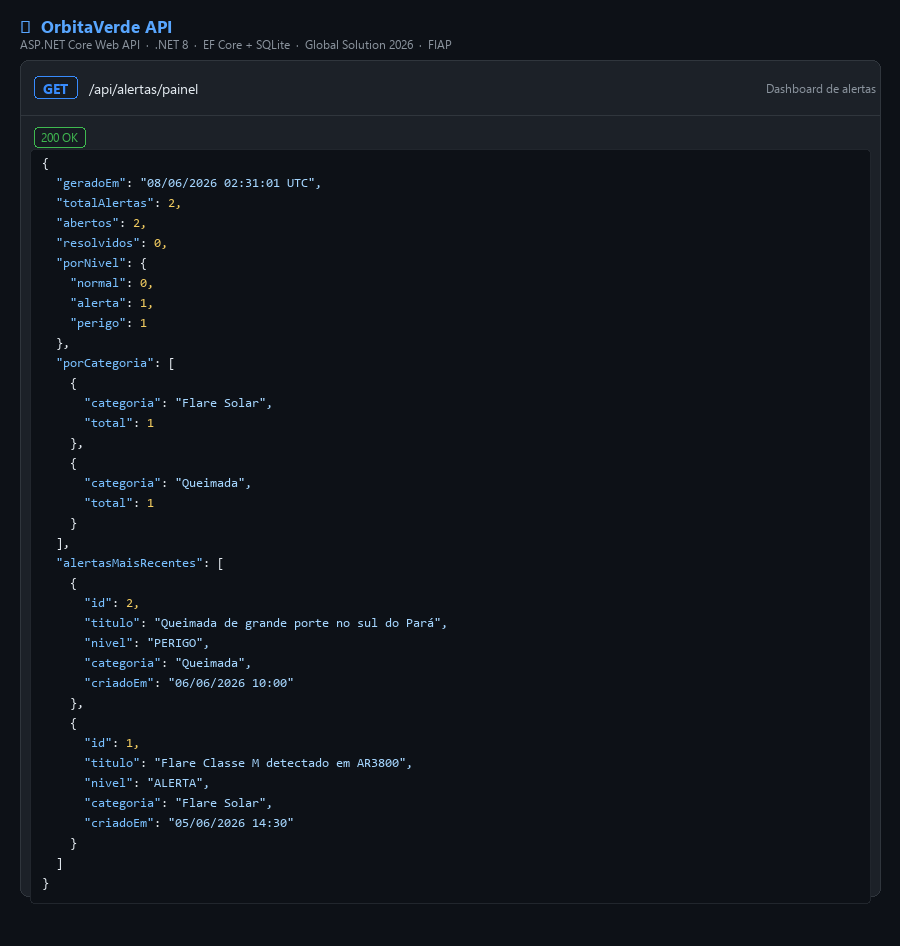
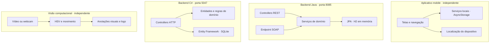

<p align="center">
  
</p>

<p align="center">
  <strong>Do alerta ambiental à experiência de uso.</strong><br />
  Um projeto acadêmico que explora APIs, aplicações mobile e visão computacional.
</p>

<p align="center">
  <a href="#explore-o-projeto">Módulos</a> ·
  <a href="#veja-o-código-em-ação">Demonstração</a> ·
  <a href="#arquitetura">Arquitetura</a> ·
  <a href="#execute-localmente">Execução</a> ·
  <a href="#decisões-de-engenharia">Decisões técnicas</a>
</p>

## Por que OrbitaVerde?

Um alerta ambiental precisa de contexto: **o que aconteceu, onde, qual a gravidade e como acompanhar sua resolução?** O OrbitaVerde usa esse problema como ponto de partida para desenvolver uma interface mobile, duas implementações de backend e um detector visual de fogo e fumaça.

Construído para o **Global Solution 2026 da FIAP**, o projeto reúne quatro módulos executáveis de forma independente. Este repositório centraliza o código e a documentação, permitindo explorar cada tecnologia sem perder a visão do conjunto.

**Estado atual:** protótipo acadêmico. O app usa dados locais de demonstração; as APIs possuem seus próprios bancos; o detector trabalha sobre vídeo. A conexão entre módulos e o consumo de dados externos de satélites são próximos passos, ainda não implementados.

## Explore o projeto

| Módulo | O que você encontra | Tecnologias |
| :--- | :--- | :--- |
| [Aplicativo mobile](apps/mobile/README.md) | Cadastro de alertas, filtros, resolução, localização e temas claro/escuro | React Native · TypeScript · Expo Router · AsyncStorage |
| [Backend Java](backends/java/README.md) | APIs REST e SOAP, persistência, validação e relatórios por polimorfismo | Java 17 · Spring Boot · JPA · H2 |
| [Backend C#](backends/csharp/README.md) | Satélites, sensores, regiões e alertas com regras de domínio e painel de indicadores | C# · ASP.NET Core 8 · Entity Framework · SQLite |
| [Visão computacional](vision/fire-smoke-detector/README.md) | Detecção de fogo e fumaça por cor e movimento, com anotações sobre vídeo | Python · OpenCV · NumPy |

As APIs Java e C# são **implementações distintas**, desenvolvidas para explorar requisitos e tecnologias diferentes. Seus contratos e modelos não são intercambiáveis.

## Veja o código em ação

### Interface mobile e detecção visual

<table>
  <tr>
    <th>Aplicativo · dados locais de demonstração</th>
    <th>Visão computacional · vídeo incluído</th>
  </tr>
  <tr>
    <td align="center" valign="top"></td>
    <td align="center" valign="top"></td>
  </tr>
</table>

Capturas geradas durante a verificação do projeto: a interface web do app usa os dados iniciais locais, e o detector processa o vídeo incluído no repositório.

O detector combina máscaras HSV, operações morfológicas e subtração de fundo, sem treinamento de modelo de machine learning. [Explore o algoritmo](vision/fire-smoke-detector/detector.py).

> O valor `confidence` é uma heurística, não uma probabilidade calibrada. O protótipo não foi validado para uso operacional na detecção de incêndios.

<details>
<summary><strong>Explore também o painel da API C#</strong></summary>




O endpoint [`GET /api/alertas/painel`](backends/csharp/OrbitaVerde.API/Controllers/AlertasController.cs) reúne alertas abertos e resolvidos, níveis de gravidade e categorias. A imagem é uma evidência da entrega original; a [documentação de execução](backends/csharp/README.md) permite reproduzir a consulta.

</details>

## Arquitetura



O diagrama representa as conexões presentes no código. No Java, REST e SOAP compartilham serviços internos; a API REST não faz uma requisição SOAP pela rede. Consulte a [arquitetura detalhada](docs/architecture/README.md) e as [decisões de projeto](docs/architecture/decisions.md).

## Decisões de engenharia

**Regras de negócio no domínio.** No C#, alertas compartilham uma base abstrata e especializam mensagens e categorias. O método `Resolver()` impede resolver novamente um alerta; o controller traduz essa condição em HTTP 409. [Veja a implementação](backends/csharp/OrbitaVerde.API/Domain/Entities/Alerta.cs).

**Dois protocolos, uma lógica.** No Java, REST e SOAP usam serviços compartilhados, evitando duplicar consulta e cadastro de satélites. O schema XSD define o contrato SOAP. [Veja o contrato](backends/java/src/main/resources/wsdl/satelite.xsd).

**Interface independente para demonstrar os fluxos.** No mobile, o armazenamento local permite explorar alertas sem subir um servidor. Facilita a demonstração, mas não oferece sincronização nem autenticação de produção. [Veja os serviços](apps/mobile/services).

**Detecção visual interpretável.** No Python, intervalos de cor, área dos contornos e movimento podem ser inspecionados diretamente. Isso permite entender as decisões e limitações do detector. [Veja os parâmetros](vision/fire-smoke-detector/detector.py).

## Execute localmente

Cada módulo possui requisitos próprios. Comece pelo que deseja avaliar; não é necessário executar os quatro ao mesmo tempo.

```bash
git clone https://github.com/duduescudero/orbita-verde.git
cd orbita-verde
```

| Para explorar | Requisitos | Próximo passo |
| :--- | :--- | :--- |
| Interface mobile | Node.js 20, npm e ambiente compatível com Expo SDK 52 | [Iniciar o app](apps/mobile/README.md#execução) |
| API Java | JDK 17 e Maven 3.9 | [Consultar REST/SOAP](backends/java/README.md#execução) |
| API C# | .NET SDK 8 | [Consultar o painel](backends/csharp/README.md#execução) |
| Detector visual | Python 3.10+, pip e ambiente gráfico | [Processar o vídeo](vision/fire-smoke-detector/README.md#execução) |

Os READMEs dos módulos contêm comandos, endereços e exemplos. As APIs são ambientes locais de desenvolvimento, com dados de exemplo.

[Veja as verificações executadas e seus limites](docs/verification.md).

## Organização do repositório

```text
orbita-verde/
├── apps/mobile/                 Interface e armazenamento local
├── backends/java/               API REST e SOAP · Spring Boot
├── backends/csharp/              API HTTP · ASP.NET Core
├── vision/fire-smoke-detector/   Processamento de vídeo · OpenCV
├── docs/
│   ├── architecture/            Arquitetura e decisões técnicas
│   ├── media/                   Identidade visual e demonstração
│   └── consolidation.md         Organização dos quatro módulos
└── .github/workflows/           Verificação dos módulos
```

## Evolução planejada

- Conectar o app a uma API, definindo contrato único e configuração de ambiente.
- Substituir o login local de demonstração por autenticação segura.
- Implementar ingestão de dados externos com origem e frequência documentadas.
- Criar testes de regras de negócio e de integração das APIs.
- Avaliar o detector em vídeos rotulados, incluindo falsos positivos e negativos.

Veja os [limites atuais e o roteiro de evolução](docs/architecture/roadmap.md). Estes itens são propostas, não funcionalidades já entregues.

## Autoria

**Eduardo Escudero** · Estudante de Engenharia de Software na FIAP.

Projeto desenvolvido por Eduardo Escudero para o **Global Solution 2026 da FIAP**. Responsável pela implementação dos quatro módulos: aplicativo mobile, backend Java, backend C# e visão computacional.

[GitHub](https://github.com/duduescudero)
